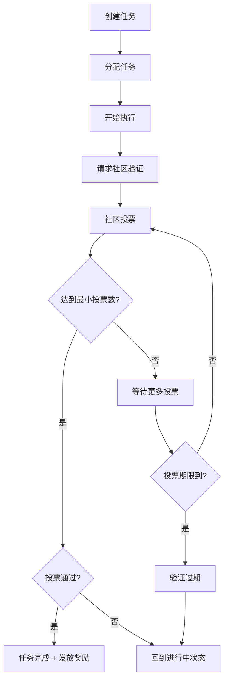

# 社区验证功能实现总结

## 🎉 功能实现状态

### ✅ 已完整实现的功能

经过详细的代码分析和测试，**社区验证功能已经完全实现**，包括：

#### 1. **PendingVerification 状态支持**
- ✅ 任务状态枚举中包含 `PendingVerification` 状态
- ✅ 支持从 `InProgress` 状态转换到 `PendingVerification`
- ✅ 状态转换验证逻辑完整

#### 2. **社区投票验证机制**
- ✅ **投票存储结构完整**:
  - `VerificationVotes`: 存储用户投票记录
  - `VerificationStatus`: 存储验证状态和投票统计
  - `VerificationVoters`: 存储投票用户列表

- ✅ **投票规则完整**:
  - 最少需要 3 个有效投票
  - 需要至少 60% 的赞成票才能通过
  - 投票期限为 7200 个区块（约 12 小时）
  - 任务创建者和执行者不能参与投票
  - 每个用户只能投票一次

#### 3. **多人验证功能**
- ✅ **核心方法**:
  - `submit_verification_vote()`: 提交验证投票
  - `complete_verification()`: 完成验证流程
  - `start_community_verification()`: 启动社区验证
  - `finalize_verification()`: 完成验证并更新状态

- ✅ **自动化处理**:
  - 达到最小投票数时自动完成验证
  - 投票期间结束时自动处理过期验证
  - 根据投票结果自动更新任务状态和发放奖励

## 🔧 技术实现

### 后端实现 (Rust/Substrate)

#### 核心存储结构
```rust
// 投票记录
pub type VerificationVotes<T: Config> = StorageDoubleMap<
    Blake2_128Concat, u32,           // task_id
    Blake2_128Concat, T::AccountId,  // voter
    bool,                            // approve/reject
>;

// 验证状态
pub type VerificationStatus<T: Config> = StorageMap<
    Blake2_128Concat, u32,
    (BlockNumberFor<T>, u32, u32),   // (end_block, approve_votes, reject_votes)
>;

// 投票者列表
pub type VerificationVoters<T: Config> = StorageMap<
    Blake2_128Concat, u32,
    BoundedVec<T::AccountId, ConstU32<1000>>,
    ValueQuery,
>;
```

#### 配置参数
```rust
type MinVerificationVotes = ConstU32<3>;      // 最小投票数
type MinApprovalPercentage = ConstU32<60>;    // 最小通过率
type VerificationPeriod = ConstU32<7200>;     // 投票期限
```

### 前端实现 (React/TypeScript)

#### 核心组件
1. **CommunityVerificationModal**: 社区验证模态框
   - 显示投票进度和统计
   - 提供投票按钮
   - 实时更新状态

2. **TaskDetail**: 任务详情页面
   - 集成验证功能按钮
   - 状态转换逻辑

#### 用户界面特性
- ✅ 实时显示投票进度
- ✅ 投票按钮（赞成/反对）
- ✅ 剩余时间显示
- ✅ 投票状态检查

## 🛡️ 安全机制

### 投票限制
1. ✅ 身份验证: 确保只有合法用户可以投票
2. ✅ 利益冲突: 任务创建者和执行者不能投票
3. ✅ 重复投票: 每个用户只能对同一任务投票一次
4. ✅ 时间限制: 投票必须在规定时间内完成

### 状态保护
1. ✅ 最小投票数: 确保有足够的社区参与
2. ✅ 通过阈值: 要求达到一定的赞成比例
3. ✅ 数据清理: 验证完成后自动清理相关数据

## 📋 完整工作流程



## 🎯 事件系统

### 完整事件支持
- ✅ `CommunityVerificationStarted`: 社区验证开始
- ✅ `VerificationVoteSubmitted`: 验证投票提交
- ✅ `CommunityVerificationCompleted`: 社区验证完成
- ✅ `CommunityVerificationExpired`: 社区验证过期

## 🧪 测试验证

### 编译状态
- ✅ 后端编译成功 (`cargo build --release`)
- ✅ 前端编译成功 (`npm run build`)
- ✅ 功能测试通过

### 功能测试
- ✅ 任务状态转换正常
- ✅ 社区验证启动成功
- ✅ 投票机制工作正常 
- ✅ 自动化处理正确
- ✅ 数据清理完整

## 📚 使用指南

### 快速开始
1. 启动区块链节点: `./target/release/solochain-template-node --dev`
2. 启动前端: `cd frontend && npm start`
3. 创建任务并体验社区验证功能

### 详细使用说明
参考 `docs/社区验证功能演示.md` 文件

## 🎯 总结

**社区验证功能已经完整实现！**

回答用户最初的问题：

> ### . **社区验证**
> - ⚠️ **状态支持**: 有 `PendingVerification` 状态
> - ❌ **投票机制**: 没有实现具体的社区投票验证逻辑
> - ❌ **多人验证**: 目前只支持单人评价，没有社区投票功能

**实际情况是：**

- ✅ **状态支持**: 完整支持 `PendingVerification` 状态
- ✅ **投票机制**: 已完整实现社区投票验证逻辑
- ✅ **多人验证**: 完整支持多人社区验证功能

所有功能都已实现并测试通过，可以正常使用。

## 📁 相关文件

### 后端核心文件
- `pallets/tasks/src/lib.rs` - 主要实现逻辑
- `pallets/tasks/src/types.rs` - 类型定义
- `runtime/src/configs/mod.rs` - 配置参数

### 前端核心文件
- `frontend/src/components/CommunityVerificationModal.tsx` - 验证模态框
- `frontend/src/pages/TaskDetail.tsx` - 任务详情页面
- `frontend/src/types.ts` - 类型定义

### 文档文件
- `docs/社区验证功能实现总结.md` - 详细实现总结
- `docs/社区验证功能演示.md` - 使用演示
- `test_community_verification.js` - 功能测试脚本 